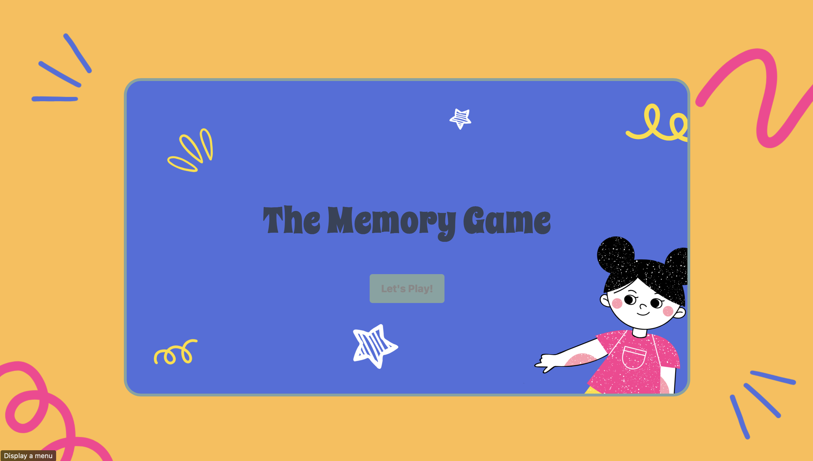

# The Memory Game 
> The game is designed to help improve memory skills, making it easier to remember and retain information. It's a great way to practice and enhance mental sharpness. My primary reason for creating this game was to learn and grow through the development process.



--------

## Getting Started

### Play the Game 
[The Memory Game Link](https://hawrahusain.github.io/Memory-Game/)

### How to Play 
1. Start the Game:
    - Click "Start Game" on the welcome screen.
2. Enter Your Name:
    - Input your name and click next.
3. Choose a Category: 
    - Pick one of the three categories: Animals, Flags, or Periodic Table.
4. Select Difficulty:
    -  Choose a grid size (Easy: 4x4, Medium: 6x6, Hard: 8x8).
5. Understand the Rules: 
    - Review the display game rules before starting.
6. Match pairs: 
    - Flip two cards at a time. Match all pairs before the timer runs out.
    - Avoid mismatches to prevent game over.

## Planning Materials 

[View Planning Document](https://trello.com/b/UcVTFYqD/memory-game)

----------

## Attributuions 

- [Sound Effects](https://pixabay.com/sound-effec)
- [Card images](https://www.flaticon.com/packs/wildlife-129)
- [Backgrounds](https://www.canva.com)
- [Font](https://fonts.google.com/specimen/Spicy+Rice)

---------
## Technologies Used


-------
# The Card Generate 
GenerateCards is to create the grid based on difficulty level user select and category selection by choosing images randomly from images arrays  

```javascript 
function generateCards(category, gridSize) {
    const totalCards = gridSize * gridSize;
    const pairs = totalCards / 2;

    const imagesArray = category === 'Animals' ? animalImages :
                        category === 'Flags' ? flagImages : 
                        periodicTableImages;

    const selectedImages = shuffleArray(imagesArray).slice(0, pairs);
    const gameImages = shuffleArray([...selectedImages, ...selectedImages]); // Duplicate images

    gameImages.forEach((image, index) => {
        const card = document.createElement('div');
        card.className = 'card';
        card.dataset.index = index;

        const cardFront = document.createElement('div');
        cardFront.className = 'card-front';
        cardFront.style.backgroundImage = `url(${image})`;

        const cardBack = document.createElement('div');
        cardBack.className = 'card-back';
        cardBack.textContent = index + 1;

        card.appendChild(cardFront);
        card.appendChild(cardBack);
        document.querySelector('.game-board').appendChild(card);
    });
}

```
# Category Selection Implementation
Player will select their desired category to move on
```javascript
const selectCategoryDialog = document.querySelector('.select-category-dialog');
const categoryButtons = selectCategoryDialog.querySelectorAll('.category-btn');

```
Category Images are stored in arrays
```javascript
const animalImages = [
    'images/Animals/lion.png', 'images/Animals/tiger.png', 
    'images/Animals/elephant.png', 'images/Animals/giraffe.png',
//etc 
];

const flagImages = [
    'images/Flags/1.png', 'images/Flags/3.png', 
    'images/Flags/2.png', 'images/Flags/4.png',
//etc
];

const periodicTableImages = [
    'images/PeriodicTable/1.png', 'images/PeriodicTable/3.png', 
    'images/PeriodicTable/2.png', 'images/PeriodicTable/4.png',
    //etc
];

```
when a category selected , the level selection is updated to show  

# Level Implementation
 player will select their desired level via buttons in the level selection dialog.

```javascript
const selectLevelDialog = document.querySelector('.select-level-dialog');
const levelButtons = selectLevelDialog.querySelectorAll('.level-btn');
```
Each button corresponds to a level:
- Easy: 4x4 grid (16 cards)
- Medium: 6x6 grid (36 cards)
- Hard: 8x8 grid (64 cards)

The level buttons dynamically update with images based on the selected category:
```javascript 
function updateLevelImages(category) {
    levelButtons.forEach((button, index) => {
        const level = index === 0 ? 'easy' : index === 1 ? 'medium' : 'hard';
        const img = button.querySelector('img');
        img.src = levelImages[category][level];
        img.alt = `${category} ${level} image`;
    });
}
```

levelImages used to map categories to images based on category selection:
```javascript
const levelImages = {
    Animals: {
        easy: 'images/Grids/easy-orange.png',
        medium: 'images/Grids/medium-orange.png',
        hard: 'images/Grids/hard-orange.png',
    },
    Flags: {
        easy: 'images/Grids/easy-yellow.png',
        medium: 'images/Grids/medium-yellow.png',
        hard: 'images/Grids/hard-yellow.png',
    },
    'Periodic Table': {
        easy: 'images/Grids/easy-purple.png',
        medium: 'images/Grids/medium-purple.png',
        hard: 'images/Grids/hard-purple.png',
    },
};
```
 When a level button is clicked, the selected grid size is stored, and the game rules dialog is displayed: 

```javascript 
levelButtons.forEach((button) => {
    button.addEventListener('click', (event) => {
        selectedGrid = button.textContent.trim(); // Store selected grid size
        selectLevelDialog.close();

        const gameRuleTitle = gameRulesDialog.querySelector('.rule-title');
        gameRuleTitle.textContent = `How to play matching ${selectCategory} (${selectedGrid})`;
        gameRulesDialog.showModal(); // Show rules dialog
    });
});
```
# Show Rules of th Game
user will view modal that contains the rules of the game and when clicks on start game here the game will start 

# Game story 
The game will start when user clicks on "Start Game" after 5 second the cards will flip
```javascript
function startGame() {
    const gridSize = selectedGrid === '4x4' ? 4 : selectedGrid === '6x6' ? 6 : 8;
    totalPairs = (gridSize * gridSize) / 2;
    generateCards(selectCategory, gridSize);

    timeLeft = gridSize === 4 ? 60 : gridSize === 6 ? 90 : 120;

    resetButton.style.display='block';
    correctMatche.style.display='block';
    wrongMatche.style.display='block';
    wrongMatche.textContent = `Wrong Matches: ${wrongMatches}`;
    correctMatche.textContent = `Correct Matches: ${correctMatches}`;
    timerElement.style.display = 'block'; // Show the timer when the game starts
    timerElement.textContent = `Time: ${timeLeft}s`;
    const gameBoard = document.querySelector('.game-board');
    gameBoard.className = `game-board grid-${gridSize}`;

    console.log(`Game started with ${selectCategory} category and ${gridSize}x${gridSize} grid.`);

    const cards = document.querySelectorAll('.card');
    const startSound = new Audio('sounds/countDown.mp3'); //get the sound
    startSound.play(); //play the sound

    // Reveal all cards for 5 seconds
    cards.forEach(card => card.classList.add('flipped'));

    setTimeout(() => {
        // Hide all cards after 3 seconds
        cards.forEach(card => card.classList.remove('flipped'));
        isGameActive = true; // Allow interaction after initial reveal
        startTimer(); // Start the game timer
         // play sound when start timer
    }, 5000); // 5000ms = 5 seconds
}

```
Then the Timer will start to count down based on the level selected 

```javascript

function startTimer() {
   
    startTimersound.play();
    timer = setInterval(() => {
        timeLeft--;
        timerElement.textContent = `Time: ${timeLeft}s`;

        if (timeLeft <= 0) {
            startTimersound.pause(true);
            endGame(false, 'timeout'); // Time ran out
        }
    }, 1000);
}

```
There will show the correct matchs and the wrong matchs but based on the level selected will be diffrent limit for the wrong matchs

```javascript 
function getMismatchLimit(gridSize) { //set the get mismatch limit 
    if (gridSize === '4x4') {
        return 6;
    } else if (gridSize === '6x6') {
        return 8;
    } else if (gridSize === '8x8') {
        return 10;
    }
}
function checkForMatch() {
    const mismatchLimit = getMismatchLimit(selectedGrid);
    const isMatch =
        firstCard.querySelector('.card-front').style.backgroundImage ===
        secondCard.querySelector('.card-front').style.backgroundImage;

    if (isMatch) {
        correctMatches++;
        correctMatche.textContent = `Correct Matches: ${correctMatches}`;
        firstCard.classList.add('matched');
        secondCard.classList.add('matched');
        resetBoard();

        if (correctMatches === totalPairs) {
            endGame(true); //win
        }
    } else {
        wrongMatches++;
        wrongMatche.textContent = `Wrong Matches: ${wrongMatches}`;
        setTimeout(() => {
            firstCard.classList.remove('flipped');
            secondCard.classList.remove('flipped');
            resetBoard();

            if (wrongMatches >= mismatchLimit) { //get the limit of mismatch 
                endGame(false ,'mismatch'); // mismatch game over
            }
        }, 1000);
    }
}
```

## Reset Button 
There is a resert button to resert the game any time 


```javascript
resetButton.addEventListener('click', () => {
    resetSounds(); 
    playButtonSound(); 
    location.reload(); 
});
```

## Conditions for Losing the Game

1. For a 4x4 grid, the maximum allowed incorrect matches is 6.
2. For a 6x6 grid, the maximum allowed incorrect matches is 8.
3. For an 8x8 grid, the maximum allowed incorrect matches is 10.
4. For a 4x4 grid, the time limit is 1 minute.
5. For a 6x6 grid, the time limit is 2 minutes.
6. For an 8x8 grid, the time limit is 3 minutes.


## Conditions for Winning the Game

1. The user wins by matching all the cards before the time runs out.

## Future Improvements 
- Add multiplayer.
- Add more categories and levels.
- Hide the cards when they match.
- Add animation shacking when the match is wrong.


